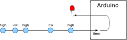
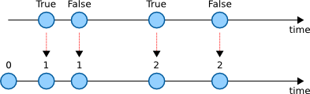
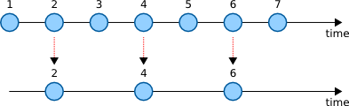
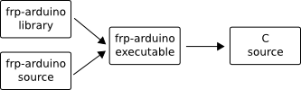

* [Introduction](#introduction)
* [The language](#the-language)
  * [FRP](#frp)
    * [Transforming](#transforming)
    * [Keeping state](#keeping-state)
    * [Filtering](#filtering)
  * [EDSL](#edsl)
  * [Compiles to C](#compiles-to-c)
* [Examples](#examples)
  * [Running the examples](#running-the-examples)
  * [Example: Blinking led](#example-blinking-led)
  * [Example: Blinking pair of leds](#example-blinking-pair-of-leds)
  * [Example: Blinking with variable frequency](#example-blinking-with-variable-frequency)
  * [Example: Writing bytes on UART](#example-writing-bytes-on-uart)
  * [Example: Displaying text on LCD](#example-displaying-text-on-lcd)
* [API](#api)
* [Questions](#questions)
* [Contributing](#contributing)
* [Resources](#resources)
* [License](#license)
* [This document](#this-document)

## Introduction

We believe that programming the [Arduino](http://arduino.cc/) can be *more fun*
if we don't have to use the C language to program it. We aim to create a new
language that allows us to program the Arduino using higher-level
constructs. Our mission:

**Arduino programming without the hassle of C**

## The language

The language we create has the following properties:

* It is based on the functional reactive programming (FRP) paradigm
* It is implemented as a deeply embedded domain specific language (EDSL) in
  Haskell
* It compiles to C code

Lets explore them in more detail.

### FRP

This section introduces FRP and shows how it fits in the domain of programming
an Arduino.

The central building block in FRP is a **stream**. A stream contains values
that change over time. Consider an input pin on the Arduino. If we constantly
read the value of the pin we will get different values (high or low) over time:


We could take this stream and assign it to an output pin. Whenever there is a
new value on the input stream, that value will be sent to the output pin. In
this example we have a led connected to the output pin:



So building an Arduino application using FRP involves capturing inputs as
streams, doing some interesting calculations (we'll come to that), and
assigning streams to outputs.

#### Transforming

The most common thing we do with streams is to transform the values in some
way. This operation is called map ([`mapS`](http://hackage.haskell.org/package/frp-arduino/docs/Arduino-DSL.html#v:mapS)). Let's say we have a
stream of numbers:


We can transform this stream to a stream of booleans by mapping a function that
converts even numbers to true and odd numbers to false:


We now have a stream that alternates its boolean value at a time interval.

Mapping is always a one-to-one conversion.

#### Keeping state

Streams can also be used to keep track of state. We achieve that with the fold
([`foldpS`](http://hackage.haskell.org/package/frp-arduino/docs/Arduino-DSL.html#v:foldpS)) operation.

A fold is like a map where we also have access to a state and the output is the
new state.

Let's say we have a stream of booleans representing if a button is pressed or
not. Now we want a stream that keeps track of the number of button presses. We
can do that by folding the following function (pseudo code) with an initial
`clickCount` value of 0:

    if buttonIsPressed
        clickCount + 1
    else
        clickCount



The very first time `clickCount` is 0. Subsequent values are incremented by one
if the boolean value is true, otherwise we just pass the current `clickCount`
along.

#### Filtering

Sometimes we would like to discard values from a stream. We do that with the
filter ([`filterS`](http://hackage.haskell.org/package/frp-arduino/docs/Arduino-DSL.html#v:filterS)) operation.

We can for example keep all even numbers in a stream:



### EDSL

Our language is embedded in the Haskell language. That means that when we write
programs in our language, we are actually writing Haskell programs.

However, our programs will not look like standard Haskell because they use
custom operators that are more suited to the FRP paradigm.

By hosting our language inside Haskell, as opposed to making up our own custom
syntax, we gain a few things:

* We don't have to write our own parser
* We can take advantage of Haskell's advanced type system

When we combine our program with the language library, we get an executable
that, when run, will produce a C file:



The executable is a compiler from our EDSL to C.

### Compiles to C

In order to make our EDSL execute on the Arduino, we compile it to a C source
file which we then turn into avr assembly code by using the avr gcc toolchain.

## Examples

In this section we will see what our EDSL looks like and what kinds of programs
we can write using it.

### Running the examples

Command to compile an example:

    ./make [name of example]

Command to compile and upload an example to a connected Arduino:

    ./make [name of example] upload

Before we can run these commands, we need to install a few dependencies:

* [The Haskell platform](https://www.haskell.org/platform/)
* [Arduino-Makefile](https://github.com/sudar/Arduino-Makefile)

Haskell should be installed system wide, but Arduino-Makefile should just be
copied to the root of this repository.

In order to use Arduino-Makefile, we also need standard build tools like make
and gcc, and in particular, the [gcc toolchain for avr](http://www.nongnu.org/avr-libc/).

On a Fedora system, we can install all dependencies with the following
commands:

    yum install haskell-platform
    yum install arduino-core
    git clone https://github.com/sudar/Arduino-Makefile.git

The arduino-core package depends on the following packages:

* avr-gcc
* avr-gcc-c++
* avr-libc
* avrdude

### Example: Blinking led

<p align="center">
  <a href="http://youtu.be/UdIXmmp-6tw">
      
  </a>
</p>

```haskell
import Arduino.Uno

main = compileProgram $ do

    digitalOutput pin13 =: clock ~> toggle
```

* Source code: [examples/Blink.hs](examples/Blink.hs)
* Generated C code (no need to understand this): [examples/Blink.c](examples/Blink.c)
* Compile and upload command: `./make Blink upload`

This is the hello world of Arduino programs.

Lets examine this example line by line:

```haskell
import Arduino.Uno
```

This imports functions that allow us to define a program in the EDSL.

```haskell
main = compileProgram $ do
```

The `main` function is the standard `main` function in Haskell. The
[`compileProgram`](http://hackage.haskell.org/package/frp-arduino/docs/Arduino-DSL.html#v:compileProgram) function has the following type:

```haskell
compileProgram :: Action a -> IO ()
```

That means that we can define a set of actions in the do-block that we pass to
`compileProgram`. It takes those actions, builds an internal representation of
the program, and then generates C code and writes that to a file.

So what action is defined by the last line in the example?

```haskell
digitalOutput pin13 =: clock ~> toggle
```

Let's look at the type for the [`=:`](http://hackage.haskell.org/package/frp-arduino/docs/Arduino-DSL.html#v:-61-:) operator:

```haskell
(=:) :: Output a -> Stream a -> Action ()
```

It takes an output of a specific type and connects it to a stream of values of
the same type.

The types of [`digitalOutput`](http://hackage.haskell.org/package/frp-arduino/docs/Arduino-Uno.html#v:digitalOutput) and [`pin13`](http://hackage.haskell.org/package/frp-arduino/docs/Arduino-Uno.html#v:pin13)
reveal that we have an output for bits:

```haskell
digitalOutput :: GPIO -> Output Bit

pin13 :: GPIO
```

That means that the stream we define on the right hand side has to be a stream
of bits. The stream is created with the following expression:

```haskell
clock ~> toggle
```

Let's look at the types of the individual components:

```haskell
clock :: Stream Word

(~>) :: Stream a -> (Stream a -> Stream b) -> Stream b

toggle :: Stream Word -> Stream Bit
```

[`clock`](http://hackage.haskell.org/package/frp-arduino/docs/Arduino-Uno.html#v:clock) is a built in stream that produces incrementing
integers at a given time interval.

[`toggle`](http://hackage.haskell.org/package/frp-arduino/docs/Arduino-Library.html#v:toggle) is a function that converts a stream of words to a
stream of bits by mapping the [`isEven`](http://hackage.haskell.org/package/frp-arduino/docs/Arduino-DSL.html#v:isEven) function: Even words are
converted to 1 and odd words are converted to 0.

[`~>`](http://hackage.haskell.org/package/frp-arduino/docs/Arduino-DSL.html#v:-126--62-) is an operator that takes a stream on the left hand side
and a function on the right hand side. The result is a stream that we get by
applying the function to the stream on the left hand side.

The resulting stream in the example is a stream of bits that toggles between 1
and 0 values at a specific time interval. When we connect that stream to the
pin where the led is connect, the led will blink at a specific time interval.

### Example: Blinking pair of leds

<p align="center">
  <a href="http://youtu.be/dWl3nfAJy08">
      
  </a>
</p>

```haskell
import Arduino.Uno

main = compileProgram $ do

    let doubleOutput = output2 (digitalOutput pin12) (digitalOutput pin13)

    doubleOutput =: every 5000 ~> flip2TupleStream

flip2TupleStream :: Stream a -> Stream (Bit, Bit)
flip2TupleStream = foldpS (\_ -> flip2Tuple) (pack2 (bitLow, bitHigh))
    where
        flip2Tuple :: Expression (a, b) -> Expression (b, a)
        flip2Tuple tuple = let (aValue, bValue) = unpack2 tuple
                           in pack2 (bValue, aValue)
```

* Source code: [examples/DoubleBlink.hs](examples/DoubleBlink.hs)
* Generated C code (no need to understand this): [examples/DoubleBlink.c](examples/DoubleBlink.c)
* Compile and upload command: `./make DoubleBlink upload`

This example shows how to group two values together and output them to two
different outputs.

### Example: Blinking with variable frequency

```haskell
import Arduino.Uno
import Data.Tuple (swap)

main = compileProgram $ do

    setupAlternateBlink pin11 pin12 (createVariableTick a0)

setupAlternateBlink :: GPIO -> GPIO -> Stream a -> Action ()
setupAlternateBlink pin1 pin2 triggerStream = do
    output2 (digitalOutput pin1) (digitalOutput pin2) =: alternate triggerStream
    where
        alternate :: Stream a -> Stream (Bit, Bit)
        alternate = foldpS2Tuple (\_ -> swap) (bitLow, bitHigh)

createVariableTick :: AnalogInput -> Stream ()
createVariableTick limitInput = accumulator limitStream timerDelta
    where
        limitStream :: Stream Word
        limitStream = analogRead limitInput ~> mapS analogToLimit
        analogToLimit :: Expression Word -> Expression Word
        analogToLimit analog = 1000 + analog * 20
```

* Source code: [examples/FrequencyBlink.hs](examples/FrequencyBlink.hs)
* Generated C code (no need to understand this): [examples/FrequencyBlink.c](examples/FrequencyBlink.c)
* Compile and upload command: `./make FrequencyBlink upload`

This is like blinking a pair of leds except that the frequency of the blinks in
this example depends on an analog input.

### Example: Writing bytes on UART

```haskell
import Arduino.Uno

main = compileProgram $ do

    digitalOutput pin13 =: clock ~> toggle

    uart =: timerDelta ~> mapSMany formatDelta ~> flattenS

formatDelta :: Expression Word -> [Expression [Byte]]
formatDelta delta = [ formatString "delta: "
                    , formatNumber delta
                    , formatString "\r\n"
                    ]
```

* Source code: [examples/UART.hs](examples/UART.hs)
* Generated C code (no need to understand this): [examples/UART.c](examples/UART.c)
* Compile and upload command: `./make UART upload`

This example shows how to write bytes to the UART output.

### Example: Displaying text on LCD

```haskell
import Arduino.Uno
import qualified Arduino.Library.LCD as LCD

main = compileProgram $ do

    tick <- def clock

    digitalOutput pin13 =: tick ~> toggle

    setupLCD [ bootup ~> mapSMany (const introText)
             , timerDelta ~> mapSMany statusText
             ]

introText :: [Expression LCD.Command]
introText = concat
    [ LCD.position 0 0
    , LCD.text "FRP Arduino"
    ]

statusText :: Expression Word -> [Expression LCD.Command]
statusText delta = concat
    [ LCD.position 1 0
    , LCD.text ":-)"
    ]

setupLCD :: [Stream LCD.Command] -> Action ()
setupLCD streams = do
    LCD.output rs d4 d5 d6 d7 enable =: mergeS streams
    where
        rs     = digitalOutput pin3
        d4     = digitalOutput pin5
        d5     = digitalOutput pin6
        d6     = digitalOutput pin7
        d7     = digitalOutput pin8
        enable = digitalOutput pin4
```

* Source code: [examples/LCD.hs](examples/LCD.hs)
* Generated C code (no need to understand this): [examples/LCD.c](examples/LCD.c)
* Compile and upload command: `./make LCD upload`

This example shows how to display text on an LCD display.

## API

The API documentation for the latest version is hosted on Hackage:

http://hackage.haskell.org/package/frp-arduino

## Questions

We want to be welcoming to newcomers.

In particular, if there is something you don't understand, please let us know
and we'll try to explain it and improve our documentation.

To ask a question,
[create a new issue](https://github.com/frp-arduino/frp-arduino/issues/new)
and attach the question label.

## Contributing

The contributors are listed in [AUTHORS](AUTHORS) (add yourself).

We use the [C4.1 (Collective Code Construction Contract)](http://rfc.zeromq.org/spec:22)
process for contributions.
More discussions and explanations of the process can be found in the
[The ZeroMQ Community](http://zguide.zeromq.org/page:all#Chapter-The-ZeroMQ-Community),
in particular [here](http://zguide.zeromq.org/page:all#The-ZeroMQ-Process-C).

Comments on the process:

> A patch MUST compile cleanly and pass project self-tests on at least the
> principle target platform.

In our case, this means that `./test` should run without failure.

[](https://travis-ci.org/frp-arduino/frp-arduino)

## Resources

* [Domain-specific Languages and Code Synthesis Using Haskell](http://queue.acm.org/detail.cfm?id=2617811)
* [Tech Mesh 2012 - Making EDSLs fly - Lennart Augustsson](https://www.youtube.com/watch?v=7gF7iFB4mFY)
* [Representing DSL expressions in Haskell](http://augustss.blogspot.se/2007/06/representing-dsl-expressions-in-haskell.html)

## License

The Haskell library that implements the language and all examples are free
software, distributed under the GNU General Public License, version 3. For more
information, see [COPYING](COPYING).

## This document

This document ([README.md](README.md)) is automatically generated from the
sources in the [doc](doc) folder by running `python doc/generate_readme.py`.
