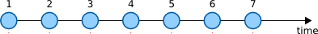
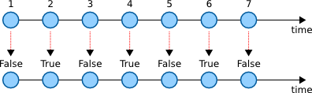

* [Introduction](#introduction)
* [The language](#the-language)
  * [FRP](#frp)
  * [EDSL](#edsl)
  * [Compiles to C](#compiles-to-c)
* [Examples](#examples)
  * [Running the examples](#running-the-examples)
  * [Example: Blinking a led](#example-blinking-a-led)
  * [Example: Blinking two leds](#example-blinking-two-leds)
* [Contributing](#contributing)
* [License](#license)
* [This document](#this-document)

## Introduction

We believe that programming the [Arduino](http://arduino.cc/) can be *more fun*
if we don't have to use the C language to program it. We aim to create a new
language that allows us to program the Arduino using higher-level
constructs. Our mission:

**Arduino programming without the hassle of C**

## The language

The language we create has the following properties:

* It is based on the functional reactive programming (FRP) paradigm
* It is implemented as a deeply embedded domain specific language (EDSL) in
  Haskell
* It compiles to C code

Lets explore them in more detail.

### FRP

This sections introduces FRP and shows how it fits in the domain of programming
an Arduino.

The central building block in FRP is a **stream**. A stream contains values
that change over time. Consider an input pin on the Arduino. If we constantly
read the value of the pin we will get different values (high or low) over time
depending on if a button connected to that pin is pressed or not:


We could take this stream and assign it to an output pin. Whenever there is a
new value on the input stream, that value will be sent to the output pin.

The most common thing we to with streams is to convert the values in some way.
It is called map. There is a built in stream called `clock` that increments an
integer at some time interval:



We can convert this stream to a stream of booleans by mapping the `even`
function on it:



We now have a stream that alternates its boolean value at a time interval.
This stream can be connected to an output pin that has a led connected to it to
make the led blink.

### EDSL

Our language is embedded in the Haskell language. That means that when we write
programs in our language, we are actually writing Haskell programs.

However, our programs will not look like standard Haskell because they use
custom operators that are more suited to the FRP paradigm.

By hosting our language inside Haskell, as opposed to making up our own custom
syntax, we gain a few things:

* We don't have to write our own parser
* We can take advantage of Haskell's advanced type system

When we combine our program with the language library, we get an executable
that, when run, will produce a C file:


The executable is a compiler from our EDSL to C.

### Compiles to C

In order to make our EDSL execute on the Arduino, we compile it to a C source
file which we then turn into avr assembly code by using the avr gcc toolchain.

## Examples

In this section we will see what our EDSL looks like and what kinds of programs
we can write using it.

### Running the examples

Command to compile an example:

    ./make [name of example]

Command to compile and upload an example to a connected Arduino:

    ./make [name of example] upload

Before we can run these commands, we need to install a few dependencies:

* [The Haskell platform](https://www.haskell.org/platform/)
* [Arduino-Makefile](https://github.com/sudar/Arduino-Makefile)

Haskell should be installed system wide, but Arduino-Makefile should just be
copied to the root of this repository.

In order to use Arduino-Makefile, we also need standard build tools like make
and gcc, and in particular, the [gcc toolchain for avr](http://www.nongnu.org/avr-libc/).

On a Fedora system, we can install all dependencies with the following
commands:

    yum install haskell-platform
    yum install arduino-core
    git clone https://github.com/sudar/Arduino-Makefile.git

The arduino-core package depends on the following packages:

* avr-gcc
* avr-gcc-c++
* avr-libc
* avrdude

### Example: Blinking a led

```haskell
import Arduino.Uno

main = compileProgram $ do

    pin13 =: clock ~> toggle
```

Source code: [examples/Blink.hs](examples/Blink.hs). Generated C code: [examples/Blink.c](examples/Blink.c).
Compile and upload command:

    ./make Blink upload

[](http://youtu.be/UdIXmmp-6tw)

### Example: Blinking two leds

```haskell
import Arduino.Uno

main = compileProgram $ do

    toggled <- def $ clock ~> toggle

    pin13 =: toggled

    pin12 =: toggled ~> invert
```

Source code: [examples/DoubleBlink.hs](examples/DoubleBlink.hs). Generated C code: [examples/DoubleBlink.c](examples/DoubleBlink.c).
Compile and upload command:

    ./make DoubleBlink upload

## Contributing

The contributors are listed in [AUTHORS](AUTHORS) (add yourself).

We use the [C4.1 (Collective Code Construction Contract)](http://rfc.zeromq.org/spec:22) process for contributions.

Comments on the process:

> A patch MUST compile cleanly and pass project self-tests on at least the
> principle target platform.

In our case, this means that `./test` should run without failure.

## License

The Haskell library that implements the language and all examples are free
software, distributed under the GNU General Public License, version 3. For more
information, see [COPYING](COPYING).

## This document

This document ([README.md](README.md)) is automatically generated from the
sources in the [doc](doc) folder by running `python doc/generate_readme.py`.
